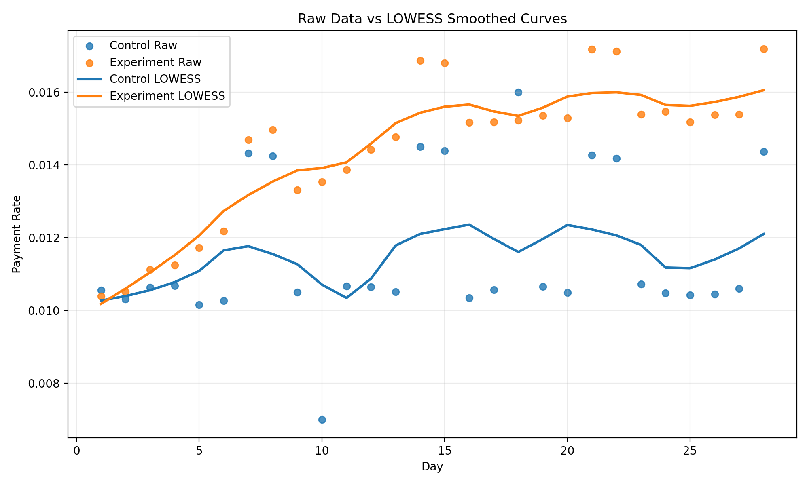
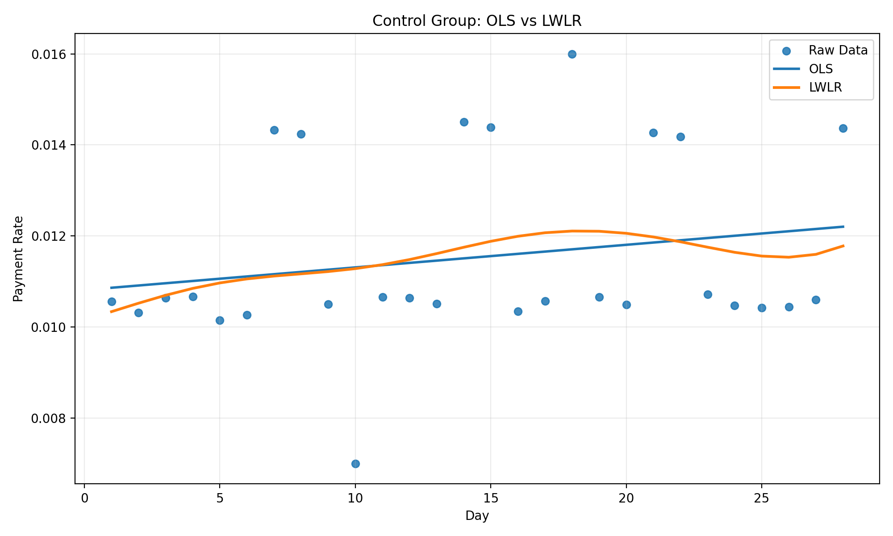
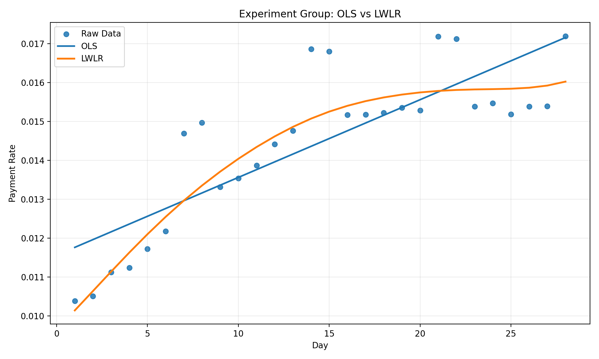
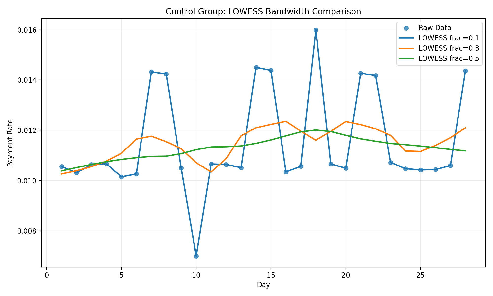
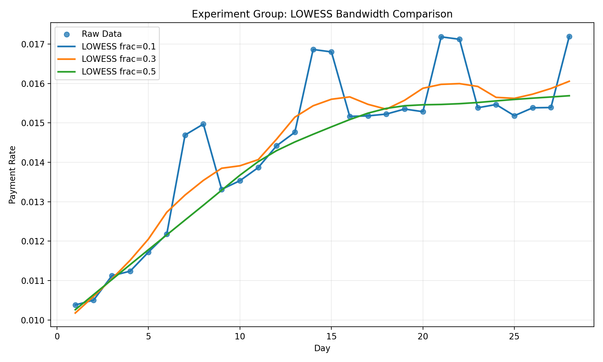

# 机器学习实验7：局部加权线性回归（LWLR）与LOWESS平滑原生实现

## 实验概述

本实验围绕“短剧游戏付费指标平滑场景”展开，使用 Python 与 NumPy 原生实现局部加权线性回归（LWLR）与 LOWESS 平滑算法，并在 28 天 AB 实验模拟数据上完成趋势分析。实验数据包含对照组与实验组每日付费率，其中同时存在周末周期波动、随机噪声和局部异常点。实验通过对比全局 OLS、局部 LWLR 与 LOWESS 平滑结果，验证局部建模方法在高波动时序指标分析中的优势。最终生成原始散点图、平滑曲线对比图和不同带宽参数效果图，用于观察策略生效时点、异常点抑制效果以及参数选择对平滑结果的影响。

## 实验目标

1. **理解全局与局部回归差异**：掌握普通最小二乘回归（OLS）、局部加权线性回归（LWLR）与 LOWESS 平滑的基本思想，理解全局建模与局部建模的本质差异。
2. **掌握局部加权方法原理**：掌握高斯核权重、带宽参数与鲁棒迭代在局部加权方法中的作用，并理解它们对平滑结果的影响。
3. **实现核心算法**：能够基于 Python 原生实现 LWLR 与 LOWESS，不依赖现成封装接口完成局部回归建模。
4. **应用业务场景分析**：通过短剧游戏 AB 实验的付费率数据，观察策略生效阶段、周末周期波动和异常点对模型拟合的影响。
5. **参数调优与结果解释**：能够结合可视化结果对业务趋势做出解释，并分析不同带宽参数下的过拟合与欠拟合现象。

## 环境与数据集

### 实验环境
- **Python版本**：3.8及以上
- **核心库**：
  - `numpy` (≥1.24.0)：数值计算与矩阵运算
  - `pandas` (≥2.0.0)：数据处理
  - `matplotlib` (≥3.7.0)：数据可视化
  - `statsmodels` (≥0.14.0)：LOWESS 验证
- **随机种子**：固定为 42，确保结果可复现。

### 数据集
实验数据由 `generate_abtest_data()` 函数生成，共 28 天（day 1~28），包含以下字段：

- **day**：实验天数（1~28）
- **control**：对照组付费率（含周末波动、噪声与异常点）
- **experiment**：实验组付费率（模拟“第3天策略开始生效、第7天后进一步增强”的业务过程）
- **is_weekend**：是否周末（1表示周末，0表示工作日）

**数据集关键设计**：
1. **对照组**：整体稳定，周末存在明显上扬（+0.38%），并刻意加入第10天骤降（0.70%）和第18天误报升高（1.60%）两个异常点。
2. **实验组**：第3天开始生效，第7天后进一步增强，整体付费率随时间提升，周末效应较弱（+0.18%）。
3. **噪声**：两组数据均加入高斯噪声（标准差约 0.015%~0.018%）。

为便于局部回归计算，代码将 day 标准化到 [0,1] 区间，作为 LWLR 的输入特征。

## 方法

### 核心原理

#### 1. 普通最小二乘回归（OLS）
OLS 假设所有样本共享同一套全局线性规律，其解析解为：
\[
\beta = (X^T X)^{-1} X^T y
\]
其中 \(X\) 为设计矩阵（含截距项），\(y\) 为观测值。OLS 对所有样本赋予相同权重，输出一条全局直线。

#### 2. 局部加权线性回归（LWLR）
LWLR 为每个预测点 \(x_0\) 引入权重矩阵 \(W\)，权重由高斯核函数决定：
\[
w_i = \exp\left(-\frac{\|x_i - x_0\|^2}{2\tau^2}\right)
\]
其中 \(\tau\) 为带宽参数，控制权重衰减速度。局部模型的闭式解为：
\[
\beta = (X^T W X)^{-1} X^T W y
\]
对于每一个预测点，都需要重新计算权重并拟合一套局部线性参数，因此 LWLR 能够更好地刻画局部趋势。

#### 3. LOWESS 平滑
LOWESS 可视为 LWLR 的平滑扩展，主要步骤为：
1. **距离权重**：在局部邻域内使用 tricube 权重函数 \( (1 - |u|^3)^3 \)（\(|u| < 1\)）。
2. **加权线性回归**：在邻域内拟合加权最小二乘。
3. **鲁棒迭代**：利用 bisquare 权重 \( (1 - u^2)^2 \) 对残差进行二次加权，降低异常点影响。
4. **多次迭代**：重复步骤 2~3（默认 3 次），得到最终平滑曲线。

### 算法实现

实验代码分为三个模块：

1. **`datasets.py`**：生成 28 天 AB 实验数据，并提供天数标准化函数。
2. **`lwlr.py`**：实现高斯核权重、OLS 拟合、LWLR 单点预测、LWLR 全样本预测，以及原生 LOWESS 平滑。
3. **`experiment.py`**：组织实验流程，生成控制组/实验组的 OLS、LWLR、LOWESS 结果，调用 `statsmodels.lowess` 做正确性验证，并保存 5 张图。

## 实验步骤与结果

### 1. 数据准备与可视化
调用 `generate_abtest_data(random_seed=42)` 生成模拟数据，将 day 标准化后作为特征。原始数据散点图展示两组付费率的日度波动、周末峰值及异常点。

### 2. OLS 全局回归
对两组数据分别进行全局 OLS 拟合，得到两条直线（图2、图3中的蓝色曲线）。

### 3. LWLR 局部回归
设置带宽参数 \(\tau = 0.15\)，对每个点进行局部加权回归，得到两条平滑曲线（图2、图3中的橙色曲线）。

### 4. LOWESS 平滑
使用原生实现的 LOWESS（`frac=0.3, it=3`）对两组数据进行平滑，并与 `statsmodels.lowess` 结果对比验证。

### 5. 带宽参数比较
分别对 `frac=0.1, 0.3, 0.5` 三种带宽参数进行 LOWESS 平滑，观察参数对平滑结果的影响（图4、图5）。

### 6. 关键数值结果

#### 表1：主要统计指标对比
| 指标 | 对照组（原始） | 实验组（原始） | 对照组（LOWESS平滑） | 实验组（LOWESS平滑） |
|------|---------------|---------------|-------------------|-------------------|
| 平均付费率 | 1.153% | 1.446% | 1.147% | 1.436% |
| OLS RMSE | 0.001992 | 0.001147 | - | - |
| LWLR RMSE | 0.001928 | 0.000832 | - | - |
| 与 statsmodels 的 MAE | - | - | 0.00006931 | 0.00012543 |

**关键结论**：
- 实验组相对对照组提升 **0.289 个百分点**，提升比例约 **25.23%**。
- LWLR 的 RMSE 均低于 OLS，表明局部模型更贴合具有阶段性变化的业务数据。
- 原生 LOWESS 与 statsmodels 的误差极小（MAE < 0.00013），验证实现正确性。

#### 表2：关键日期原始值与平滑值对比
| 天数 | 对照组原始值 | 对照组平滑值 | 实验组原始值 | 实验组平滑值 |
|------|-------------|-------------|-------------|-------------|
| 10   | 0.0070      | 0.0107      | 0.0135      | 0.0139      |
| 18   | 0.0160      | 0.0116      | 0.0152      | 0.0153      |

**异常点修正效果**：
- 第10天对照组原始值骤降到 0.70%，平滑后恢复为 1.07%。
- 第18天对照组原始值误报为 1.60%，平滑后回落到 1.16%。
- LOWESS 有效削弱了孤立异常点对趋势判断的干扰。

#### 表3：不同带宽参数效果分析
| 带宽（frac） | 平滑程度 | 异常点抑制 | 局部趋势保留 | 适用场景 |
|-------------|----------|------------|--------------|----------|
| 0.1 | 较低（过拟合） | 弱 | 强 | 数据噪声小，需捕捉细微变化 |
| 0.3 | 适中（推荐） | 强 | 适中 | 一般日度数据，平衡噪声与趋势 |
| 0.5 | 较高（欠拟合） | 很强 | 弱 | 数据噪声大，只需宏观趋势 |

### 7. 可视化结果

实验共生成 5 张图表，完整记录了从原始数据到参数对比的全过程：

**图1 原始散点与 LOWESS 平滑曲线对比**

*原始数据散点（对照组蓝色、实验组橙色）与 LOWESS 平滑曲线（frac=0.3）对比。平滑曲线有效抑制了异常点，同时保留了周末周期波动和策略生效趋势。*

**图2 对照组 OLS 与 LWLR 对比**

*对照组 OLS（蓝色直线）与 LWLR（橙色曲线）对比。LWLR 更贴合局部波动，对第10天、第18天异常点具有更强的鲁棒性。*

**图3 实验组 OLS 与 LWLR 对比**

*实验组 OLS 与 LWLR 对比。LWLR 清晰捕捉到第3天策略开始生效、第7天后进一步增强的阶段性增长趋势。*

**图4 对照组不同带宽参数对比**

*对照组 LOWESS 带宽参数对比（frac=0.1, 0.3, 0.5）。frac=0.1 过于追随噪声，frac=0.5 过度平滑，frac=0.3 在抑制噪声与保留局部变化之间取得最佳平衡。*

**图5 实验组不同带宽参数对比**

*实验组 LOWESS 带宽参数对比。同样，frac=0.3 在保留策略生效阶段变化的同时，有效平滑了随机波动。*

## 结果分析与讨论

### 1. 局部加权方法的优势
- **对异常点鲁棒**：LOWESS 通过鲁棒迭代显著降低了第10天、第18天异常点的影响，输出更符合业务认知的平滑曲线。
- **捕捉局部趋势**：LWLR 与 LOWESS 能够清晰捕捉实验组“第3天开始生效、第7天后进一步增强”的阶段性增长，而 OLS 仅能反映全局线性趋势。
- **适应周期波动**：平滑曲线保留了周末周期性上扬，证明局部方法能够同时处理趋势、周期与噪声。

### 2. 带宽参数选择规律
- **frac=0.3** 是本次 28 天日度数据较合适的带宽选择：相比 frac=0.1，它不会盲目追随噪声；相比 frac=0.5，它又能保留第3天、第7天的局部变化。
- 在实际业务中，可通过交叉验证、视觉观察或业务先验确定带宽。一般日度数据建议 frac 在 0.2~0.4 之间。

### 3. 计算效率权衡
- LWLR 与 LOWESS 需要对每个点单独拟合，计算复杂度为 \(O(n^2)\)（未优化），远高于 OLS 的 \(O(n)\)。
- 当样本规模进一步增大时，可考虑滑动窗口、近邻索引、采样或并行化等方式降低计算开销。

### 4. 与现有库的对比验证
原生 LOWESS 与 `statsmodels.lowess` 的平均绝对误差在控制组和实验组上分别仅为 0.00006931 和 0.00012543，说明本次原生实现与成熟库的输出高度一致，验证了算法实现的正确性。

## 结论

### 实验成果
1. **算法实现**：成功原生实现了 LWLR 与 LOWESS 核心算法，包括高斯核权重、tricube 距离权重、bisquare 鲁棒权重及迭代平滑流程。
2. **业务场景应用**：在短剧游戏 AB 实验付费率数据上验证了局部加权方法在高波动时序指标分析中的优势，准确识别策略生效时点、周末周期波动并抑制异常点。
3. **参数分析**：通过对比不同带宽参数，总结了 frac 选择对平滑效果的影响规律，为实际业务参数调优提供参考。
4. **正确性验证**：与 statsmodels 官方库对比误差极小，证明原生实现可靠。

### 核心发现
1. **局部优于全局**：对于具有非线性、局部变化和噪声干扰的时序业务指标，局部加权方法（LWLR/LOWESS）比单一的全局线性模型（OLS）更具解释力和实用价值。
2. **异常点处理**：LOWESS 的鲁棒迭代机制能有效抑制孤立异常点，避免其对趋势判断造成误导。
3. **参数选择关键**：带宽参数 frac 是平衡噪声平滑与趋势保留的关键，需根据数据特性和业务需求谨慎选择。

### 改进方向
1. **计算优化**：实现基于 KD‑Tree 的近邻搜索，将计算复杂度从 \(O(n^2)\) 降至 \(O(n \log n)\)，支持更大规模数据。
2. **多维度扩展**：将当前一维 LOWESS 扩展为多维局部回归（LOESS），适用于多特征业务指标。
3. **自动带宽选择**：集成交叉验证或 AIC/BIC 准则，实现带宽参数的自动选择。
4. **实时平滑**：结合滑动窗口与增量更新，实现流式数据的实时 LOWESS 平滑。

## 图表说明
实验共生成 5 张图表，均保存在 `figures/` 文件夹中：

1. **raw_vs_lowess.png**：原始散点与 LOWESS 平滑曲线对比
2. **control_ols_vs_lwlr.png**：对照组 OLS 与 LWLR 对比
3. **experiment_ols_vs_lwlr.png**：实验组 OLS 与 LWLR 对比
4. **control_bandwidth_compare.png**：对照组不同带宽参数对比（frac=0.1, 0.3, 0.5）
5. **experiment_bandwidth_compare.png**：实验组不同带宽参数对比（frac=0.1, 0.3, 0.5）

所有图表均使用英文标签，确保在不同环境（包括云端服务器）中正常显示。

---

**实验完成时间**：2026年4月  
**实验环境**：Python 3.8+, NumPy 1.24.0+, pandas 2.0.0+, matplotlib 3.7.0+, statsmodels 0.14.0+  
**代码位置**：`lab07_LWLR_LOWESS/src/`  
**图表位置**：`lab07_LWLR_LOWESS/figures/`  
**报告版本**：1.0